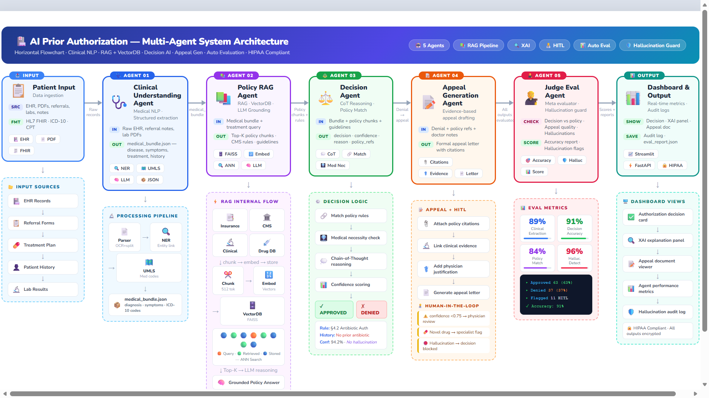
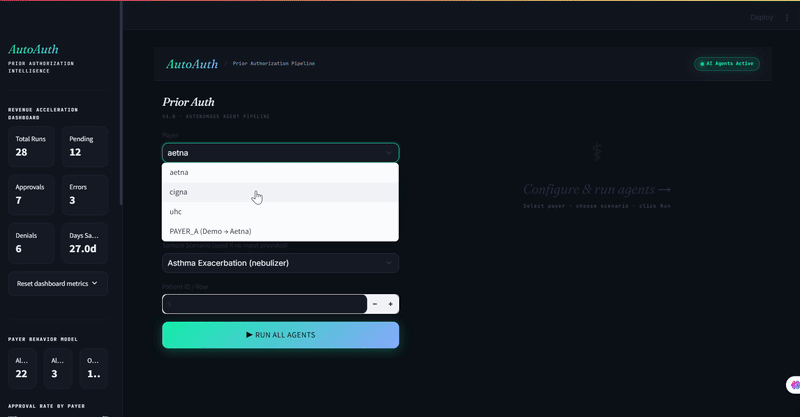

# AutoAuth — Prior Authorization Intelligence Platform

**AI-powered prior authorization decision engine** that analyzes clinical documentation, evaluates payer policies, and generates authorization decisions with appeal letters.


---





## 🏗️ Project Structure

```
autoauth/
├── README.md                          # This file
├── requirements.txt                   # Python dependencies
├── .env.example                       # Environment template
├── .gitignore                         # Git ignore rules
│
├── src/                               # Source code
│   ├── agents/                        # AI agents
│   │   ├── clinical_reader.py         # Extract ICD/CPT from clinical notes
│   │   ├── policy_engine.py           # Policy matching & decision logic
│   │   └── appeal_generator.py        # Generate appeal letters
│   │
│   ├── ui/                            # User interfaces
│   │   └── streamlit_app.py           # Streamlit web UI (new design)
│   │
│   └── utils/                         # Utilities
│       ├── env_loader.py              # Environment config loader
│       └── policy_ingestion.py        # Vector store setup
│
├── data/                              # Data files
│   ├── policies/                      # Payer policy PDFs
│   │   ├── aetna_asthma_policy.pdf
│   │   ├── cigna_diabetes_type2_policy.pdf
│   │   └── uhc_hypertension_policy.pdf
│   │
│   ├── patients.csv                   # Sample patient data (2M+ rows)
│   └── vector_store/                  # Policy embeddings (auto-generated)
│       ├── aetna/
│       ├── cigna/
│       └── uhc/
│
├── output/                            # Runtime outputs
│   ├── bundles/                       # Clinical extraction results
│   ├── results/                       # PA decision results
│   ├── dashboard_metrics.json         # Dashboard stats
│   └── run_history.json               # Historical run data
│
├── scripts/                           # Utility scripts
│   └── check_setup.py                 # Verify installation
│
├── docs/                              # Documentation
│   └── ARCHITECTURE.md                # System design docs
│
└── app.py                             # Main Streamlit app (legacy UI)
```

---
**AI-powered prior authorization decision engine** that analyzes clinical documentation, evaluates payer policies, and 
## Unique Selling Proposition
**Predictive Denial Engine**
Simulates approval probability pre-submission to prevent avoidable denials.

**Payer Behavior Learning Model**
Continuously adapts to insurer-specific approval patterns to improve accuracy over time

**Self-Healing Workflow**
Automatically adjusts to API failures, portal changes, and policy updates without manual reconfiguration Revenue Acceleration Dashboard

## 🚀 Quick Start

### 1. Install Dependencies

```bash
pip install -r requirements.txt
```

### 2. Configure Environment

Copy `.env.example` to `.env` and add your Gemini API key:

```bash
cp .env.example .env
```

Edit `.env`:
```
GEMINI_API_KEY=your_api_key_here
```

### 3. Initialize Vector Store (First Time Only)

```bash
python src/utils/policy_ingestion.py
```

This will:
- Read all PDFs from `data/policies/`
- Generate embeddings using Gemini
- Store in `data/vector_store/`

### 4. Run the Application

**Option A: New Product UI (Recommended)**
```bash
streamlit run src/ui/streamlit_app.py
```

**Option B: Legacy UI**
```bash
streamlit run app.py
```

### 5. Verify Setup

```bash
python scripts/check_setup.py
```

---

## 📊 Features

### ✅ Clinical Reader Agent
- Extracts ICD-10, CPT, HCPCS codes from EHR notes
- Supports both free-text notes and CSV patient data
- Confidence scoring for extractions
- Structured FHIR-like bundle output

### ✅ Policy Engine Agent
- Vector similarity search across payer policies
- Pre-submission risk scoring
- Approval probability prediction
- Criteria matching (met vs. missing)
- Multi-payer support (Aetna, UHC, Cigna)

### ✅ Appeal Generator Agent
- Rule-based appeal letter generation
- No LLM dependency (cost-effective)
- Professional medical appeal format
- Payer-specific addressing

### ✅ Dashboard & Analytics
- Real-time approval rate tracking
- Payer behavior modeling
- Days saved estimation
- Run history with trends

---

## 🎯 Usage Examples

### Example 1: EHR Note Input

```python
from src.agents.clinical_reader import extract
from src.agents.policy_engine import run_policy_agent

# Extract clinical data
clinical_bundle = extract("""
PATIENT: John Smith | DOB: 11/02/1981
CHIEF COMPLAINT: Severe asthma exacerbation
DX: J45.51
CPT: 94640
""", payer="uhc")

# Get authorization decision
decision = run_policy_agent(clinical_bundle)
print(decision["decision"])  # APPROVED, DENIED, or PENDING_MORE_INFO
```

### Example 2: CSV Patient Input

```python
# Use patient ID from patients.csv
clinical_bundle = extract(patient_id=1, payer="aetna")
decision = run_policy_agent(clinical_bundle)
```

### Example 3: Generate Appeal

```python
from src.agents.appeal_generator import generate_appeal

if decision["decision"] == "DENIED":
    appeal_letter = generate_appeal(clinical_bundle, decision)
    print(appeal_letter)
```

---

## 🔧 Configuration

### Supported Payers
- `aetna` — Aetna
- `uhc` — UnitedHealthcare
- `cigna` — Cigna

### Vector Store Settings
Located in `src/utils/policy_ingestion.py`:
- Chunk size: 1000 characters
- Chunk overlap: 200 characters
- Embedding model: `models/text-embedding-004`

### Model Settings
Located in agent files:
- Clinical Reader: `models/gemini-2.0-flash-exp`
- Policy Engine: `models/gemini-3-flash-preview`

---

## 📁 Data Files

### `data/patients.csv`
Sample patient dataset with 2M+ rows containing:
- Patient demographics
- ICD-10 codes
- CPT codes
- Payer information

### `data/policies/`
Real payer policy PDFs organized by:
- Payer (aetna, uhc, cigna)
- Condition (asthma, diabetes, hypertension)

### `output/`
Generated outputs:
- `dashboard_metrics.json` — Cumulative stats
- `run_history.json` — Historical run log
- `bundles/` — Clinical extraction results
- `results/` — PA decision results

---

## 🧪 Testing

```bash
# Verify installation
python scripts/check_setup.py

# Test clinical extraction
python -c "from src.agents.clinical_reader import extract; print(extract('DX: J45.51', payer='uhc'))"

# Test policy engine
python -c "from src.agents.policy_engine import run_policy_agent; print(run_policy_agent({'icd_codes': ['J45.51'], 'cpt_code': '94640', 'payer': 'uhc'}))"
```

---

## 🎨 UI Versions

### New Product UI (`src/ui/streamlit_app.py`)
- Clean horizontal 3-step flow
- Card-based design
- Insights over raw codes
- AI confidence indicators
- Modern SaaS aesthetic

### Legacy UI (`app.py`)
- Dark clinical theme
- Comprehensive metrics
- Payer behavior charts
- Full feature set

---

## 🔐 Environment Variables

Required in `.env`:
```
GEMINI_API_KEY=your_gemini_api_key
```

Optional:
```
VECTOR_STORE_PATH=./data/vector_store
POLICIES_PATH=./data/policies
OUTPUT_PATH=./output
```

---

## 📝 License

Proprietary — Internal Use Only

---

## 🤝 Support

For issues or questions, contact the development team.

---

## 🗺️ Roadmap

- [ ] Multi-model support (OpenAI, Claude)
- [ ] Real-time payer API integration
- [ ] Automated appeal submission
- [ ] Advanced analytics dashboard
- [ ] Mobile app support
